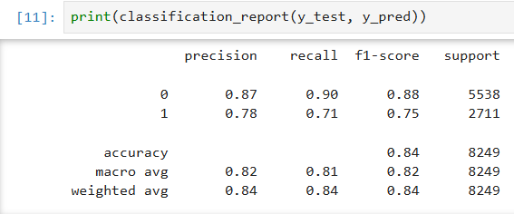
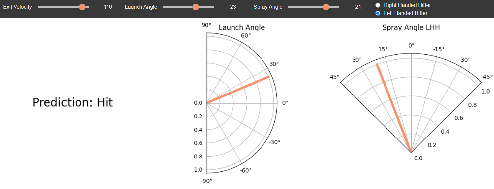
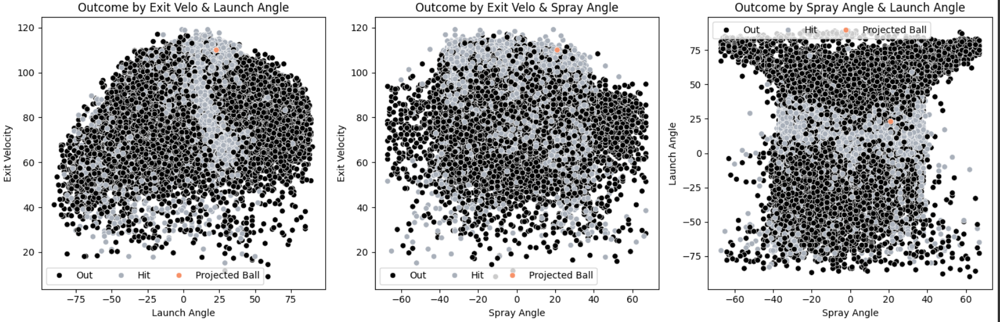

# Projecting Batted Ball Outcome using Machine Learning 
Leveraging Statcast baseball data to predict the likelihood of a successful hit using machine learning models. 

## Overview
This project explores the use of machine learning to predict batted ball outcomes in baseball. Utilizing Statcast data, the goal 
is to determine the likelihood of a successful hit based on launch angle, exit velocity, and spray angle. 
The project employs Python and popular data science libraries to develop and evaluate a predictive model.


## Gathering and Preparing Data
Statcast data is available to the public for free using [BaseballSavant.com](https://baseballsavant.mlb.com/statcast_search). Fans can create their own queries and view results on the website or download csv files. With the help of the [pybaseball](https://github.com/jldbc/pybaseball) library, we can use Python to easily scrap data from Baseball Savant. 

The following [attributes](https://baseballsavant.mlb.com/csv-docs) are collected from our query: 
 - ```stand``` : Side of the plate batter is standing. 
 - ```launch_angle``` : Launch angle of the batted ball.
 - ```launch_speed``` : Exit velocity of the batted ball. 
 - ```hc_x``` : Hit coordinate X of batted ball.
 - ```hc_y``` : Hit coordinate Y of batted ball.
 - ```events``` : Event of the resulting Plate Appearance. 

Although Baseball Savant doesn't directly provide us with spray angle, using a formula created by [Bill Petti](https://tht.fangraphs.com/research-notebook-new-format-for-statcast-data-export-at-baseball-savant/), we can find it using the ```hc_x``` and ```hc_y``` attributes.  

```python
data.hc_x = (data.hc_x - 125.42)
data.hc_y = (198.27 - data.hc_y)
spray_angle = np.round(np.arctan(data.hc_x / data.hc_y) * 180 / np.pi * 0.75)
spray_angle[data['stand'] == 'L'] *= -1 # spray angle is dependent on the hitter's handedness
data['spray_angle'] = spray_angle
```


## Model Details
This project uses [Extreme Gradient Boosting](https://xgboost.readthedocs.io/en/stable/) ([XGBoost Classifier](https://xgboost.readthedocs.io/en/latest/python/python_api.html#xgboost.XGBClassifier))
to classify outcomes as hits or outs. The dataset is split into training (80%) and testing (20%) subsets. Early stopping is used to prevent overfitting. The model's predictions are assessed using a classification report, which provides the following metrics: Precision, Recall, F1-Score, and Accuracy. 



With 0 representinmg an out and 1 a hit, we see that the model is better at predicting outs. This is to be expected because outs are more common in baseball, leading to an imbalanced dataset from Baseball Savant. 


## Predicting Batted Ball Outcomes
Using the sliders below the last cell, adjust the ball's exit velocity, launch angle, spray angle, and batter's handedness. Select Predict Outcome. 



The three graphs visualize each batted ball in the dataset, with black representing outs, gray for hits, and the predicted ball highlighted in peach. These visualizations help explain why the predicted ball was classified as a hit or an out. If your ball was a hit, you should see it grouped with other hits in one or more of these graphs. Similarly, if it was an out, it should align with other outs. This grouping reflects the model's reliance on patterns in the data to make accurate predictions.



## Setup using Google Colab
1. Using the menu bar at the top of the page, select: File -> Upload Notebook -> GitHub
 ``` 
 https://github.com/susconnor/Hit-Projector.git
 ```

2. Under Path select ```Hit_Projector.ipynb ```

3. Runtime -> Run all

## Acknowledgments
- This project makes use of the [pybaseball](https://github.com/jldbc/pybaseball) library, developed by [James LeDoux](https://github.com/jldbc) and contributors. It provides an easy interface for accessing Statcast data and other baseball statistics.   

---
---
---
